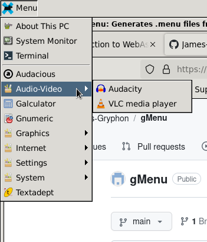

# gMenu v1.0
Generates .menu files from directory/folder contents

By James Gooch. A middling work (www.middlingworks.com)

*Last updated March 2, 2024. Subject to editing.*
___

### HISTORY ###
Linux application menus are typically autogenerated according to the FreeDesktop standard. This is convenient, so long as you're satisfied with the default behavior. But if users wish to make changes, they're told that their only recourse is editing categories in .desktop files, whether by hand or with the help of GUI tools made for this purpose. My experience is that this process is unreliable and unnecessarily destructive. It's easy for the system to destroy the user's customizations, and difficult for the user to revert to the default state.

This was frustrating when I knew that there was an easier way. As a long-time Classic Mac user, I was familiar with the Apple menu, which generated a list based on the items placed in a special folder. Why didn't this exist for Linux?

Well, now it does.

### PREREQUISITES ###
1. Python 3.9+, since 3.9 is the version I first built and tested it under. Earlier versions may work but are untested.
2. The Xfce "Applications Menu" panel applet. This is preferred because it is known to support custom application menus in the GUI. This software may be adaptable to other environments with a similar menu option, but this is currently untested and unsupported.

### INSTALLATION ###
1. Create a gMenu folder in your home directory. Copy .menu_builder.py into it.
2. Create at least one folder inside the gMenu folder. Each folder, in alphabetical order, will have its contents listed on the menu, with separator bars dividing the contents of each folder.
3. Copy or create .desktop files (or folders) into the nested gMenu folders. They will be listed in alphabetical order in their folder's area, according to their file names, so be sure to rename them in a way you find appropriate. For example, `org.xfce.mousepad.desktop` might be renamed `Mousepad.desktop`.
4. Run .menubuilder.py. If everything is well, it should create a .gMenu.menu file.
5. Edit the properties of your application menu, and select the new .menu file as your custom menu file.
6. Open the menu. If things look as they should, you're done. If not, make any changes needed to folders and desktop files and perform steps 4 and 5 again.

### ANSWERS TO POSSIBLE QUESTIONS AND STATEMENTS ###

*"Is there a way to get it to refresh automatically?"*

Yes, but I haven't gotten it to work reliably yet, which is why it isn't described in setup.

From my study, it seems running an appropriate inotifywait command on login should make this possible. In practice, it seemed to work for a period of time and then shut down without notice. Since updating menus is a relatively rare operation, I decided it was easier to run the script every time than to fix the problem. I may revisit this, though, to save time in the long run.

*"Are desktop files added automatically when I install a package?*

No. This script only looks at the folders you make and the desktop files you provide in those folders, and there's no other script to scan the system for changes. This facilitates customization, at the expense of quicker setup times.

*"Where do I find .desktop files to copy into my folders?"*

By default, .desktop files for applications installed at the system level can be found in `/usr/share/applications`.  You might also find them in `/usr/local/share/applications`, or in `~/.local/share/applications`.

*"I hate the old Apple menu."*

gMenu doesn't work any better (it's actually worse in a few respects), so if you weren't happy before, you won't like this. In this case, skipping this script is the best choice for you.

*"How is it worse than the Apple menu?"*

The main reason is that it requires special files in the first place. The Classic menu could contain actual programs, aliases (in Linux, symlinks), documents, or folders, and allow you to run any of them in the appropriate way. This only supports folders and .desktop files.

Although gMenu uses the file name for sorting, Xfce displays the names used in the .desktop file on the menu, so you may have to edit both the file name and the file contents to get it to show up in the right order with the name you want.

Finally, it currently doesn't refresh automatically, as we already discussed.

*"I think this way of managing the menu is worse than the default one, because x reason."*

If you have a specific complaint about why it's worse that can be fixed while maintaining its goals, then share it. But bear in mind that the purpose here is to allow customization without needing extensive tweaks (other than to a few names) to dozens of desktop files. Proposals that make things more like they were before aren't likely to be accepted.

*"I put folders in my folders, but they're not showing up in the menu."*

If they don't show up at the first level or the second level, that's a bug (and shouldn't be possible, from my understanding of the current script design).

If they don't show up at the third level, that's intentional. Partly it's because I didn't want to take the time to figure out indefinite folder nestings, but mostly it's because nested submenus aren't ergonomically great, and the deeper they get, the worse they are. I think three levels ought to be more than enough for anyone.

*"I have x great idea on how this can be improved."*

I'd be happy to hear about it. I don't guarantee that I'll change anything, but we'll see how things go.

*"I've implemented some changes and would like to see you adopt them."*

I'd be happy to see what they are; submit a pull request. If it's good, I'll add them, increment the version number, and give you credit somewhere in this read-me and license. If I don't like them, and we can't compromise on the matter, then I guess we'll have duelling versions of this script! As a matter of courtesy, if you are commenting about your fork of gMenu in some context where it differs from original behavior, it would be best for you to either mention that it is a fork, or to use a different name for your version, or both, so that people aren't confused about what this setup does.
